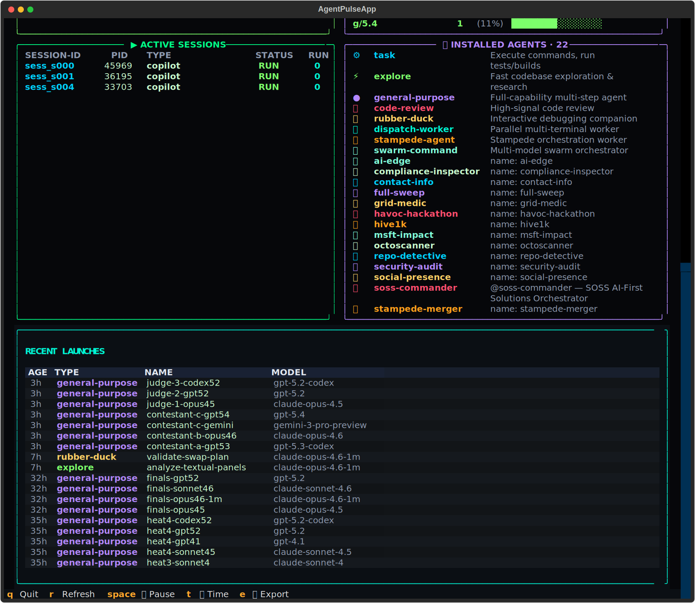

# ⚡ Agent Pulse

**Real-time agent tracking dashboard for the GitHub Copilot CLI**

🌐 **[Learn more on the website →](https://dubsopenhub.github.io/copilot-cli-agent-pulse/)**

### 🚀 Install & Launch

```bash
curl -fsSL https://raw.githubusercontent.com/DUBSOpenHub/copilot-cli-agent-pulse/main/quickstart.sh | bash
```

Then just type `agentpulse` — the dashboard opens in a new terminal window automatically.

<div align="center">

[](https://python.org)
[](https://githubnext.com/projects/copilot-cli)
[](LICENSE)

</div>

<div align="center">

</div>

---

## 🌟 Overview

Agent Pulse is a **cyberpunk-themed, real-time terminal dashboard** that monitors your GitHub Copilot CLI sessions, agents, and activity. Built with Python, [Textual](https://github.com/Textualize/textual), and [Rich](https://github.com/Textualize/rich), it gives you full observability into your AI-powered development workflow.

### ✨ Features

| Feature | Description |
|---------|-------------|
| 🖥️ **Live Session Tracking** | Real-time monitoring of active Copilot CLI terminal sessions |
| 🤖 **Agent Monitoring** | Track 15+ agent types: task, explore, general-purpose, rubber-duck, code-review, and custom agents |
| 📊 **14-Day Trend Analysis** | Sparklines, daily breakdowns, gradient bar charts, and trend arrows |
| 🔥 **24h Activity Heatmap** | Hourly session density visualization with `░▒▓█` blocks |
| 🚀 **Agent Velocity** | Agents-per-hour metric with peak concurrent tracking |
| 📱 **Responsive Layout** | 3-tier adaptive UI: full → compact → micro dashboard |
| ⚡ **Real-time Updates** | Configurable refresh rate with pulse wave animation |
| 💾 **Persistent History** | Daily stats saved to `~/.copilot/agent-pulse/` |
| 🔒 **DB Lock Resilience** | Graceful handling when the session store is busy |
| 🎨 **Cyberpunk Aesthetic** | Neon color palette with gradient effects and heartbeat animations |

---

## 🚀 Quick Start

```bash
# Clone the repo
git clone https://github.com/DUBSOpenHub/copilot-cli-agent-pulse.git
cd copilot-cli-agent-pulse

# Create a virtual environment and install dependencies
python3 -m venv .venv
.venv/bin/pip install -r requirements.txt

# Launch the live dashboard
.venv/bin/python agent_pulse.py --live
```

That's it. The dashboard auto-detects your Copilot CLI sessions and starts monitoring.

### Shell Commands

Add these aliases to your `~/.zshrc` or `~/.bashrc`:

```bash
alias agentpulse='~/copilot-cli-agent-pulse/start.sh'
alias agentdashboard='~/copilot-cli-agent-pulse/start.sh'
```

Then just type **`agentpulse`** or **`agentdashboard`** from anywhere — the live dashboard **automatically opens in a new terminal window** so it never blocks your current session.

---

## 🎮 Modes

| Mode | Command | Description |
|------|---------|-------------|
| **Live** | `python agent_pulse.py` | Launch the live Textual dashboard (default) |
| **Export** | `python agent_pulse.py --export` | JSON export to stdout |
| **No Splash** | `python agent_pulse.py --no-splash` | Skip boot animation |

### Options

```
--export,    -e          Export JSON to stdout
--no-splash              Skip boot animation
--version,   -v          Show version number
```

---

## 🏗️ Architecture

```
┌──────────────────┐     ┌──────────────────┐     ┌──────────────────┐
│  Process Scanner │     │  Session Store    │     │  Event Parser    │
│  (ps aux)        │────▶│  (SQLite DB)      │────▶│  (events.jsonl)  │
└──────────────────┘     └──────────────────┘     └──────────────────┘
         │                        │                        │
         ▼                        ▼                        ▼
┌─────────────────────────────────────────────────────────────────────┐
│                      collect_all_stats()                            │
│  Merges: procs, sessions, DB stats, agents, skills, history        │
└─────────────────────────────────────────────────────────────────────┘
                              │
                              ▼
┌─────────────────────────────────────────────────────────────────────┐
│                    Adaptive Layout Engine                           │
│  Full (≥100w, ≥40h) → Compact (≥80w) → Micro (<80w or <24h)      │
└─────────────────────────────────────────────────────────────────────┘
                              │
                              ▼
┌─────────────────────────────────────────────────────────────────────┐
│                      Textual App (TUI)                                │
│  Banner │ Metrics │ Sessions │ Agents │ Health │ Models │ Tokens      │
└─────────────────────────────────────────────────────────────────────┘
```

### Data Sources

| Source | Path | What It Provides |
|--------|------|-----------------|
| Process table | `ps aux` | Active Copilot CLI processes (PID, CPU, MEM) |
| Session store | `~/.copilot/session-store.db` | Total/daily/weekly/monthly session counts, turn counts |
| Session state | `~/.copilot/session-state/` | Active sessions, lock files, event streams |
| Agent registry | `~/.copilot/agents/` | Installed agent definitions |
| History cache | `~/.copilot/agent-pulse/history.json` | Persistent daily statistics |

---

## 📊 Dashboard Panels

### Banner
- ASCII art title with animated pulse wave (`▁▂▃▄▅▆▇█▇▆▅▄▃▂`)
- Heartbeat animation, uptime counter, live clock
- Dynamic border: green when active, cyan when idle

### Live Metrics
- Active sessions, processes, and 24h agent count
- Gradient bar charts (green → yellow → red)
- Peak concurrent, agent velocity, last agent launched

### Heatmap + Signal
- 24h activity heatmap with `░▒▓█` density blocks
- Real-time session and launch sparklines (rolling 4-min window)

### Trend Analysis
- 7-day daily breakdown with gradient bars
- 14-day sparklines with trend arrows (↑↓→)
- Session and agent counts side-by-side

### Agent Breakdown
- Stacked distribution bar by agent type
- Colored badges for 15+ agent types
- Gradient share bars per type
- Skill invocation tracking

### Active Sessions
- Live table of running Copilot CLI sessions
- Session ID, PID, agent type, status, and runtime

### Installed Agents
- Auto-discovered agent registry from `~/.copilot/agents/`
- Icon, name, and description for each agent

### Fleet Health
- Health score gauge (0–100) with status label (Excellent / Good / Warning / Critical)
- 24h success rate and error count
- Pulsing monitor indicator

### Model Distribution
- 24h breakdown of AI models used across agent launches
- Per-model count, percentage, and gradient bar

### Token Usage
- 24h token consumption with estimated cost
- Hourly token sparkline

---

## 📁 Project Structure

```
copilot-cli-agent-pulse/
├── agent_pulse.py           # Main dashboard application
├── agent_pulse.tcss         # Textual CSS stylesheet
├── pyproject.toml            # Python packaging + entry point
├── requirements.txt          # Python dependencies (rich, textual)
├── start.sh                  # Launcher (auto-opens in new terminal window)
├── quickstart.sh             # One-command installer
├── site/                     # Showcase website (GitHub Pages)
│   └── index.html
├── assets/                   # Screenshots and images
├── experimental/
│   └── ink/                  # React/Ink TUI (experimental)
│       ├── src/
│       └── package.json
├── .github/
│   ├── copilot-instructions.md
│   └── workflows/
│       ├── ci.yml
│       └── pages.yml
├── AGENTS.md
├── CONTRIBUTING.md
├── LICENSE
├── README.md
└── SECURITY.md
```

---

## 💻 Platform Support

| Platform | Status |
|----------|--------|
| macOS | ✅ Fully supported and tested |
| Linux | ⚠️ Should work (untested) |
| Windows | ❌ Not supported (`ps aux`, `SIGWINCH`) |

**Requirements:** Python 3.10+ and an active [GitHub Copilot CLI](https://githubnext.com/projects/copilot-cli) installation.

---

## 🧪 Experimental: React/Ink Implementation

An alternative dashboard implementation using React and [Ink](https://github.com/vadimdemedes/ink) lives in `experimental/ink/`. This is a separate TUI with its own component architecture.

```bash
cd experimental/ink
npm install
npm start
```

> **Note:** The Python implementation is the primary, production-ready version. The Ink version is experimental.

---

## 🤝 Contributing

See [CONTRIBUTING.md](CONTRIBUTING.md) for guidelines.

## 🔒 Security

See [SECURITY.md](SECURITY.md) for our security policy.

## 📄 License

[MIT](LICENSE) — built with ❤️ for the GitHub Copilot CLI community.

---

Built with ❤️ for the GitHub Copilot CLI community by [@DUBSOpenHub](https://github.com/DUBSOpenHub).
